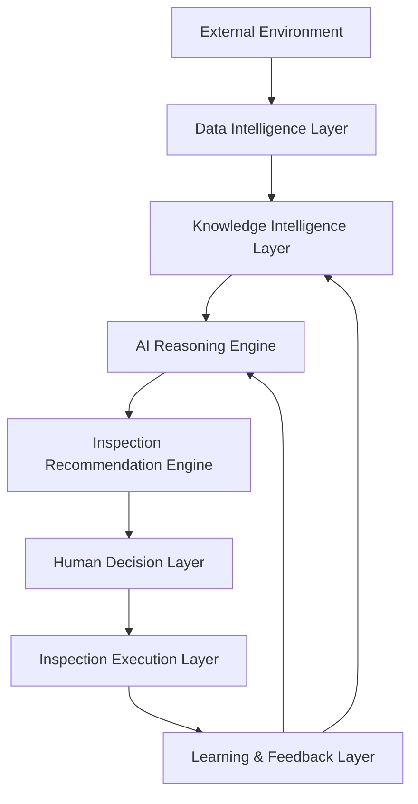
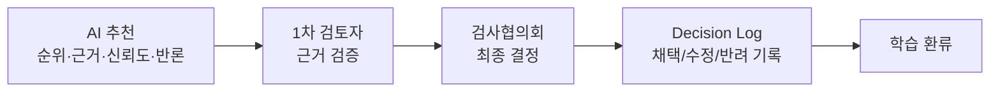

# IBK AI Inspection Planning Framework

AI 기반 은행 검사부문 선정(검사기획) 운영체계의 **기준 저장소(Reference Repository)** 입니다.
이 저장소는 단순 프롬프트 모음이 아니라, 검사기획에 AI를 도입할 때의 아키텍처·방법론·정책·거버넌스·지식체계를
하나의 일관된 체계로 정의하는 **운영 표준 저장소**입니다.

> **핵심 원칙 한 줄 요약**
> AI는 검사부문을 **결정하지 않는다.** AI는 근거와 함께 **추천(Recommendation)** 만 제시하며,
> 최종 검사부문 선정은 **검사협의회(Inspection Committee)** 가 수행한다.

---

## 1. Project Mission

은행 검사기획 과정에 **Risk-Based · Evidence-Based · Explainable AI · Human-in-the-loop · Continuous Learning**
다섯 원칙을 내재화한 AI 운영체계를 구축한다.
AI는 방대한 내·외부 데이터와 지식을 종합하여 **위험이 높은 검사부문을 설명가능한 근거와 함께 추천**하고,
사람은 그 추천을 검증·보완·결정한다.

## 2. Background

- 은행 검사기획은 한정된 검사 자원을 **위험이 높은 영역에 우선 배분**하는 의사결정이다.
- 데이터·규제·사건사고는 빠르게 증가하지만, 사람의 분석 역량과 시간은 한정되어 있다.
- 기존 검사부문 선정은 경험과 정성판단 의존도가 높아 **일관성·재현성·설명가능성**이 부족할 수 있다.
- AI는 이 과정을 대체하는 것이 아니라, **근거 기반의 일관된 추천**으로 사람의 판단을 **보강**한다.

## 3. Why this Framework is needed

| 문제 | 이 Framework의 대응 |
|------|----------------------|
| 판단의 일관성 부족 | 표준화된 Risk Scoring·Ranking 방법론 |
| 근거 추적 어려움 | Evidence-Based 서술 + Decision Log 표준 |
| AI 환각·편향 우려 | Hallucination/Bias Prevention 정책, 설명가능성 요건 |
| AI의 과도한 권한 우려 | Human-in-the-loop 거버넌스(추천/결정 분리) |
| 개선의 단절 | Learning & Feedback 구조로 지속학습 |

## 4. Overall Architecture



- **External Environment** → 규제·시장·사건사고 등 외부 환경 신호
- **Data Intelligence Layer** → 데이터 수집·정제·정규화
- **Knowledge Intelligence Layer** → 검사 유니버스·리스크 분류·매뉴얼·통제·사례·규정 지식화
- **AI Reasoning Engine** → 위험 추론·근본원인·리스크 트리·반론 사고
- **Inspection Recommendation Engine** → 점수·순위·추천(결정 아님) 산출
- **Human Decision Layer** → 검사협의회 검증·결정
- **Inspection Execution Layer** → 검사 실행
- **Learning & Feedback Layer** → 결과 피드백을 지식·추론으로 환류(Continuous Learning)

## 5. Repository Structure

```
docs/
  architecture/     아키텍처 정의 문서
  methodology/      방법론(추론·스코어링·유니버스·XAI)
  policy/           정책·헌장·윤리·출력표준
  governance/       협의회·사람검증·의사결정기록
  examples/         예시 산출물
  references/       참조 자료
knowledge/
  inspection_universe/  검사 유니버스
  risk_taxonomy/        리스크 분류체계
  inspection_manual/    검사 매뉴얼
  control_library/      통제 라이브러리
  case_library/         사건·사례 라이브러리
  regulation/           규정·법령
models/
  reasoning/        추론 모델 정의
  scoring/          스코어링 모델 정의
  ranking/          랭킹 모델 정의
  learning/         지속학습 모델 정의
templates/
  reports/          보고서 템플릿
  committee/        협의회 자료 템플릿
  scorecard/        스코어카드 템플릿
  checklist/        체크리스트 템플릿
prompts/            AI 프롬프트(추론·검사·협의회·보고)
outputs/            산출물(.gitignore 대상, 구조만 유지)
  reports/ committee/ ranking/ dashboard/
README.md
.gitignore
```

## 6. Core Principles

| 원칙 | 의미 | 저장소 내 반영 |
|------|------|----------------|
| **Risk-Based** | 위험 우선순위에 따라 자원 배분 | methodology, models/scoring·ranking |
| **Evidence-Based** | 모든 추천은 추적가능한 근거 기반 | policy(Evidence Hierarchy), governance(Decision Log) |
| **Explainable AI** | 결과는 사람이 이해·검증 가능 | methodology(AI_EXPLAINABLE_AI), 모든 문서의 Explainability Requirement |
| **Human-in-the-loop** | AI는 추천, 사람이 결정 | governance, policy(Recommendation Policy) |
| **Continuous Learning** | 결과를 환류하여 지속 개선 | architecture(06), models/learning |

## 7. Document Set

- **Architecture** — `docs/architecture/01~06`: 전체·데이터·지식·AI·거버넌스·학습 아키텍처
- **Methodology** — `docs/methodology/*`: 검사 방법론·추론·스코어링·유니버스·설명가능성
- **Policy** — `docs/policy/*`: 정책·헌장·윤리·출력표준
- **Governance** — `docs/governance/*`: 협의회 가이드·사람검증 프로세스·의사결정기록 표준
- **Knowledge / Models / Templates / Prompts** — 각 디렉터리 README 참조

## 8. How to Use

1. **정책·헌장 숙지** — `docs/policy/AI_INSPECTION_POLICY.md`, `AI_CONSTITUTION.md`
2. **방법론 이해** — `docs/methodology/AI_INSPECTION_METHOD.md`, `AI_INSPECTION_REASONING.md`
3. **지식 적재** — `knowledge/` 하위에 유니버스·리스크·규정·사례 적재
4. **AI 추론 실행** — `prompts/`의 프롬프트로 추천(순위·근거) 산출 → `outputs/`
5. **사람 검증·결정** — `docs/governance/HUMAN_REVIEW_PROCESS.md`에 따라 검사협의회가 검토·결정
6. **결정 기록** — `docs/governance/DECISION_LOG_STANDARD.md`에 따라 의사결정 로그 작성
7. **환류** — 검사 결과를 `models/learning/`·`knowledge/case_library/`로 환류

## 9. Human-in-the-loop Governance



- AI 출력은 **항상 "추천"** 으로 표기되며, 결정 권한이 없다.
- 1차 검토자는 근거·신뢰도·반론을 검증한다.
- **검사협의회가 최종 검사부문을 결정**한다(채택/수정/반려).
- 모든 결정은 사유와 함께 Decision Log에 기록된다.

## 10. Roadmap

| 단계 | 내용 | 상태 |
|------|------|------|
| Phase 0 | 저장소 구조·문서 골격 수립 | ✅ 본 저장소 초기화 |
| Phase 1 | 지식체계(유니버스·리스크·규정) 적재 | ⬜ |
| Phase 2 | 스코어링·랭킹 모델 정의·검증 | ⬜ |
| Phase 3 | 설명가능성·반론 사고 고도화 | ⬜ |
| Phase 4 | 협의회 운영·Decision Log 정착 | ⬜ |
| Phase 5 | 지속학습 루프 자동화 | ⬜ |

---

**File Owner:** 검사기획 AI 운영 담당 (Inspection Planning AI Steward)
**Version:** v0.1 (초기 구조 생성)
