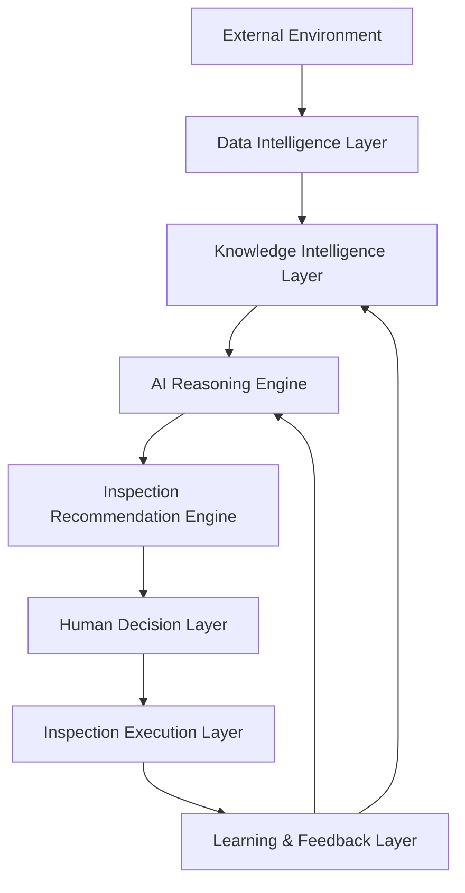

# 전체 아키텍처 (Overall Architecture)

> **공통 원칙:** AI는 검사부문을 결정하지 않고 **근거와 함께 추천**만 하며, 최종 결정은 **검사협의회(Inspection Committee)** 가 수행한다.

## 1. Purpose (목적)
AI 검사기획 운영체계의 전체 계층 구조와 데이터·지식·추론·결정·학습의 흐름을 정의한다.

## 2. Scope (범위)
외부환경 신호 수집부터 검사 실행·학습 환류까지 전 계층의 책임과 인터페이스.

## 3. Input (입력)
외부환경 신호, 내부 데이터, 지식체계, 정책·거버넌스 규칙.

## 4. Process (처리)
8계층 파이프라인으로 구성한다.

| 계층 | 책임 |
|------|------|
| External Environment | 규제·시장·사건사고 외부 신호 |
| Data Intelligence | 수집·정제·정규화 |
| Knowledge Intelligence | 유니버스·리스크·규정·사례 지식화 |
| AI Reasoning | 위험 추론·근본원인·반론 |
| Recommendation | 점수·순위·추천 산출 |
| Human Decision | 검사협의회 검증·결정 |
| Inspection Execution | 검사 실행 |
| Learning & Feedback | 결과 환류(지속학습) |

## 5. Output (출력)
계층별 인터페이스 정의와 데이터 흐름도. 각 계층 산출물은 다음 계층의 입력이 된다.

## 6. Explainability Requirement (설명가능성 요건)
산출물은 근거·신뢰도·반론을 포함하여 사람이 이해·검증·재현할 수 있어야 한다. 모든 핵심 주장에는 출처를 표기한다.

## 7. Human Review (사람의 검증)
산출물은 1차 검토자의 근거·편향 점검을 거치며, 최종 결정은 검사협의회가 수행한다.

## 8. Example (예시)
외부 규정 변경(External) → 정규화(Data) → 유니버스 매핑(Knowledge) → 추론(Reasoning) → 추천(Recommendation) → 협의회 결정(Human).

## 9. File Owner (문서 소유자)
검사기획 AI 운영 담당 (Inspection Planning AI Steward)

## 10. Version History (변경 이력)
| 버전 | 일자 | 변경 내용 | 작성 |
|------|------|-----------|------|
| v0.1 | 2026-06-30 | 초안 작성 | AI Steward |
