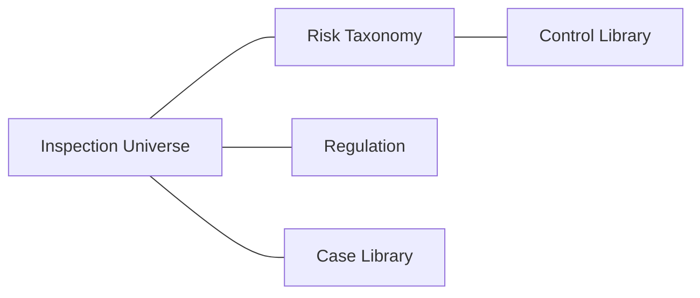

# 지식 아키텍처 (Knowledge Architecture)

> **공통 원칙:** AI는 검사부문을 결정하지 않고 **근거와 함께 추천**만 하며, 최종 결정은 **검사협의회(Inspection Committee)** 가 수행한다.

## 1. Purpose (목적)
검사 유니버스·리스크 분류·규정·통제·사례 지식을 구조화하고 연결하는 방식을 정의한다.

## 2. Scope (범위)
`knowledge/` 하위 지식 도메인의 스키마와 상호 연결 관계.

## 3. Input (입력)
검사 유니버스, 리스크 분류체계, 규정, 통제 라이브러리, 사례.

## 4. Process (처리)
각 지식 도메인을 고유 ID로 식별하고 상호 연결한다.

## 5. Output (출력)
상호 연결된 지식 그래프(부문↔리스크↔통제↔규정↔사례).

## 6. Explainability Requirement (설명가능성 요건)
산출물은 근거·신뢰도·반론을 포함하여 사람이 이해·검증·재현할 수 있어야 한다. 모든 핵심 주장에는 출처를 표기한다.

## 7. Human Review (사람의 검증)
산출물은 1차 검토자의 근거·편향 점검을 거치며, 최종 결정은 검사협의회가 수행한다.

## 8. Example (예시)
'여신 사후관리' 부문 → 신용리스크(분류) → 연체 모니터링 통제 → 관련 감독규정 → 과거 지적사례.

## 9. File Owner (문서 소유자)
검사기획 AI 운영 담당 (Inspection Planning AI Steward)

## 10. Version History (변경 이력)
| 버전 | 일자 | 변경 내용 | 작성 |
|------|------|-----------|------|
| v0.1 | 2026-06-30 | 초안 작성 | AI Steward |
