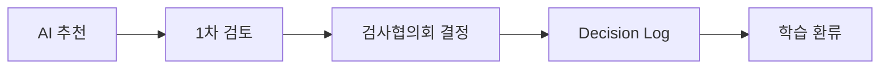

# 거버넌스 아키텍처 (Governance Architecture)

> **공통 원칙:** AI는 검사부문을 결정하지 않고 **근거와 함께 추천**만 하며, 최종 결정은 **검사협의회(Inspection Committee)** 가 수행한다.

## 1. Purpose (목적)
AI 추천과 사람의 결정을 분리하고, 검증·기록·책임 구조를 정의한다.

## 2. Scope (범위)
Human-in-the-loop 흐름, 권한 분리, 의사결정 기록 체계.

## 3. Input (입력)
AI 추천 산출물, 검토자·검사협의회 검증 결과.

## 4. Process (처리)
추천 → 1차 검토 → 협의회 결정 → 기록 → 환류.

## 5. Output (출력)
검증된 결정과 Decision Log, 책임 소재 명확화.

## 6. Explainability Requirement (설명가능성 요건)
산출물은 근거·신뢰도·반론을 포함하여 사람이 이해·검증·재현할 수 있어야 한다. 모든 핵심 주장에는 출처를 표기한다.

## 7. Human Review (사람의 검증)
산출물은 1차 검토자의 근거·편향 점검을 거치며, 최종 결정은 검사협의회가 수행한다.

## 8. Example (예시)
AI 추천 → 검토자 근거 확인 → 협의회 채택/수정/반려 → 로그 기록.

## 9. File Owner (문서 소유자)
검사기획 AI 운영 담당 (Inspection Planning AI Steward)

## 10. Version History (변경 이력)
| 버전 | 일자 | 변경 내용 | 작성 |
|------|------|-----------|------|
| v0.1 | 2026-06-30 | 초안 작성 | AI Steward |
