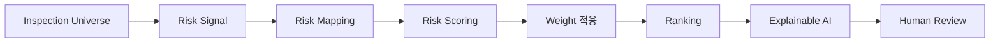

# AI 검사기획 방법론 (AI Inspection Method)

> 검사부문 후보를 **위험 신호 → 매핑 → 스코어링 → 랭킹 → 설명 → 사람검증**의
> 표준 절차로 처리하여, 설명가능한 검사부문 **추천**을 산출하는 방법론이다.

---

## 1. Purpose (목적)
검사부문 선정을 위한 AI의 처리 절차를 표준화하여 **일관성·재현성·설명가능성**을 확보한다.

## 2. Scope (범위)
검사 유니버스 정의부터 추천 출력까지의 분석 파이프라인. 최종 결정은 본 문서 범위 밖(검사협의회).

## 3. Input (입력)
- 검사 유니버스(`knowledge/inspection_universe/`)
- 리스크 분류체계(`knowledge/risk_taxonomy/`)
- 정량 데이터·규정·사례(`knowledge/`)
- 가중치·스코어링 모델(`models/`)

## 4. Process (처리)

### 4.1 Inspection Universe (검사 유니버스)
- 검사 가능한 모든 부문·업무·프로세스를 구조화한 모집단.
- 각 단위는 고유 ID·소관부서·관련 규정·통제와 연결.

### 4.2 Risk Signal (위험 신호)
- 데이터·규제·사건사고에서 위험을 시사하는 신호를 추출.
- 예: 민원 급증, 사고금액, 규정 변경, 직전 검사 경과기간.

### 4.3 Risk Mapping (리스크 매핑)
- 위험 신호를 검사 유니버스 단위 및 리스크 분류체계에 연결.
- 하나의 신호가 복수 부문에 매핑될 수 있음(다대다).

### 4.4 Risk Scoring (리스크 스코어링)
- 매핑된 신호를 정량 점수화. 차원 예시:

| 차원 | 설명 |
|------|------|
| Likelihood | 위험 발생 가능성 |
| Impact | 영향(재무·평판·규제) |
| Velocity | 위험 변화 속도/긴급성 |
| Control Gap | 통제 취약도 |
| Supervisory | 감독 관심도 |

### 4.5 Weight (가중치)
- 각 차원·신호에 가중치 부여. 가중치는 `models/scoring/`에 명시·버전관리.
- 가중치 변경은 사유와 함께 기록(설명가능성·재현성 보장).

### 4.6 Ranking (랭킹)
- 가중 점수 합산으로 검사부문 후보를 우선순위화.
- 동점·근소차는 신뢰도·반론과 함께 표기.

### 4.7 Explainable AI (설명가능성)
- 각 후보의 점수가 **어떤 근거로 산출되었는지** 분해하여 제시.
- 근거 → 차원 → 가중치 → 점수의 추적 경로 제공.

### 4.8 Confidence (신뢰도)
- 근거의 양·질·일관성에 기반해 신뢰도(상/중/하)를 부여.
- 데이터 부족·상충 시 신뢰도를 낮추고 사유 명시.

### 4.9 Alternative (대안)
- 단일 추천에 그치지 않고 대안 시나리오(병합·범위 조정·시기 조정)를 제시.

### 4.10 Counter Argument (반론)
- 추천에 반대되는 근거를 의무적으로 제시(편향 방지).

### 4.11 Human Review (사람 검증)
- 산출물은 1차 검토자·검사협의회의 검증을 거친다.

### 4.12 Output Format (출력 형식)
- 후보별 표준 카드: `부문 / 순위 / 점수 / 핵심근거 / 신뢰도 / 반론 / 대안`.

## 5. Output (출력)
- 검사부문 추천 순위표(랭킹) + 후보별 설명 카드 + 신뢰도/반론/대안.
- 산출물 위치: `outputs/ranking/`, `outputs/reports/`.

## 6. Explainability Requirement (설명가능성 요건)
- 점수 분해(근거→차원→가중치→점수)가 모든 후보에 대해 제시되어야 한다.
- 동일 입력에 대해 동일 출력이 재현되어야 한다.

## 7. Human Review (사람의 검증)
- 1차 검토자: 근거·점수 분해 검증. 검사협의회: 최종 결정.

## 8. Example (예시)

| 순위 | 부문 | 점수 | 핵심 근거 | 신뢰도 | 반론 |
|------|------|------|-----------|--------|------|
| 1 | 여신 사후관리 | 8.4 | 민원↑·규정변경·검사경과 | 中 | 사고금액↓ |
| 2 | 자산건전성 | 7.1 | 연체율↑·동종사고 | 中 | 자본비율 양호 |

> 위 표는 **추천**이며, 최종 검사부문은 검사협의회가 결정한다.

## 9. File Owner (문서 소유자)
검사기획 AI 운영 담당 (Inspection Planning AI Steward)

## 10. Version History (변경 이력)
| 버전 | 일자 | 변경 내용 | 작성 |
|------|------|-----------|------|
| v0.1 | 2026-06-30 | 초안 작성 | AI Steward |
