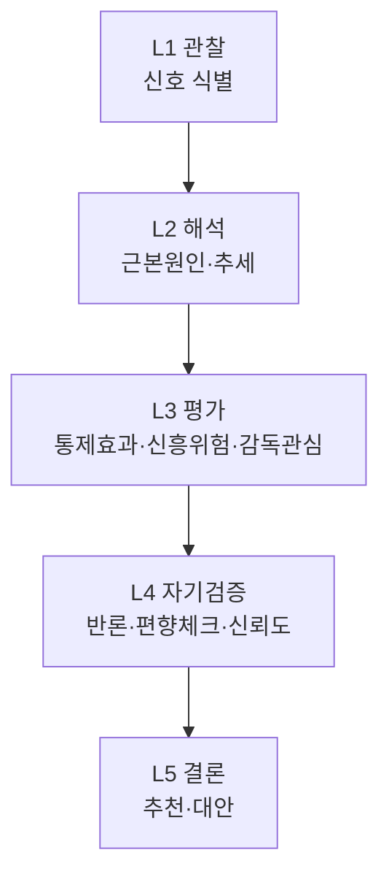
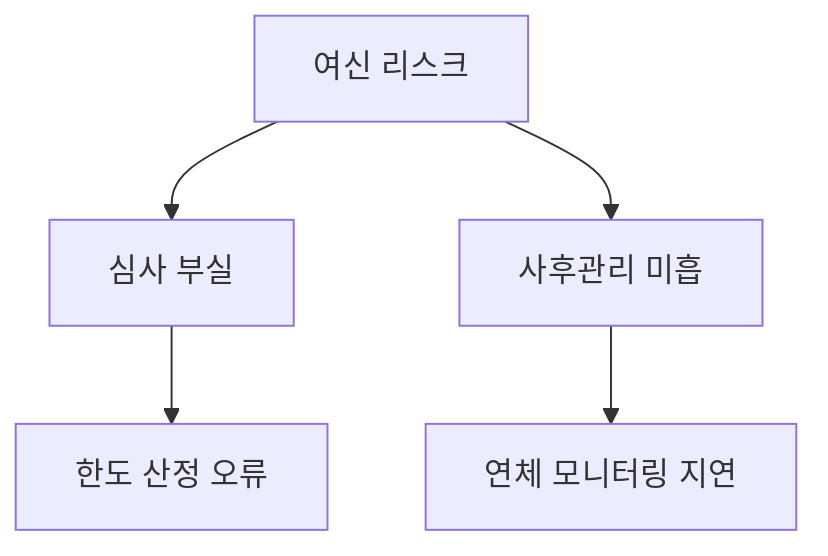

# AI 검사기획 추론 방법론 (AI Inspection Reasoning)

> AI가 위험을 **어떻게 사고(reasoning)하는지**를 정의한다.
> 단순 점수 합산이 아니라, 근본원인·추세·통제효과·반론을 거치는 **다층 추론**으로 추천의 질을 높인다.

---

## 1. Purpose (목적)
검사부문 추천의 근거가 되는 AI 추론 과정을 표준화하여, 추론이 **설명가능하고 검증가능**하도록 한다.

## 2. Scope (범위)
위험 식별·해석·추론·자기검증 단계. 점수 산식은 `AI_SCORING_ENGINE.md`, 결정은 거버넌스 문서 참조.

## 3. Input (입력)
위험 신호, 검사 유니버스, 리스크 분류체계, 통제 라이브러리, 사례·규정 지식.

## 4. Process (처리)

### 4.1 Reasoning Principle (추론 원칙)
- 근거 우선, 반론 동반, 불확실성 명시, 재현 가능.
- 결론을 먼저 정하고 근거를 맞추지 않는다(역방향 추론 금지).

### 4.2 Thinking Layer (사고 계층)

### 4.3 Root Cause (근본원인)
- 표면 신호가 아닌 **근본원인**까지 추적(예: 민원↑ → 상품설계? 영업관행? 시스템?).
- "왜?"를 반복(5 Whys)하여 검사 초점을 구체화.

### 4.4 Risk Tree (리스크 트리)
- 상위 리스크를 하위 요인으로 분해하여 구조적으로 이해.

### 4.5 Trend Analysis (추세 분석)
- 신호의 수준(level)뿐 아니라 **변화 방향·속도**를 분석.
- 급증·구조적 추세는 가중(velocity 반영).

### 4.6 Control Effectiveness (통제 효과성)
- 해당 부문의 통제가 실제로 작동하는지 평가(`knowledge/control_library/`).
- 통제 취약(Control Gap)은 위험을 가중.

### 4.7 Emerging Risk (신흥 위험)
- 과거 데이터에 없던 신규·신흥 위험(신상품, 신기술, 규제 변화)을 별도 식별.
- 데이터가 적어도 **선제 추천 + 낮은 신뢰도**로 표시.

### 4.8 Supervisory Interest (감독 관심도)
- 감독당국의 중점 검사방향·규정 변화·시장 이슈를 반영.
- 감독 관심 부문은 우선순위 가중.

### 4.9 Counter Thinking (반론 사고)
- 자기 추천을 반박하는 논거를 의무적으로 생성.
- "이 부문을 검사하지 않아도 되는 이유"를 검토하여 과잉 추천 방지.

### 4.10 Confidence (신뢰도)
- 근거의 양·질·일관성으로 신뢰도(상/중/하) 산정. 근거 상충 시 하향.

### 4.11 Bias Check (편향 점검)
- 앵커링(과거 반복 선정), 데이터 편중, 가용성 편향 점검.
- 점검 결과를 추론 로그에 기록.

### 4.12 Final Decision (최종 판단 → 추천)
- AI의 산출은 **최종 결정이 아니라 추천**이다.
- 추천·신뢰도·반론·대안을 묶어 사람에게 전달하며, **결정은 검사협의회**가 한다.

## 5. Output (출력)
추론 로그 + 후보별 추천(근본원인·리스크트리·신뢰도·반론 포함). 위치: `outputs/`.

## 6. Explainability Requirement (설명가능성 요건)
- 각 추천에 사고 계층(L1~L5)의 흔적이 남아야 한다.
- 근본원인·반론·편향 점검 결과가 명시되어야 한다.

## 7. Human Review (사람의 검증)
- 1차 검토자는 근본원인·반론의 타당성을 검증. 검사협의회가 최종 결정.

## 8. Example (예시)
> **관찰(L1):** 방카슈랑스 불완전판매 민원 +52%.
> **근본원인(L3):** 신상품 교육 부족 + 핵심성과지표 과당경쟁 의심.
> **반론(L4):** 표본 민원 소액·계절성 가능.
> **결론(L5):** "방카슈랑스 판매절차 부문 검사 추천(신뢰도 中), 대안: 영업점 표본 점검."
> → 최종 결정은 검사협의회.

## 9. File Owner (문서 소유자)
검사기획 AI 운영 담당 (Inspection Planning AI Steward)

## 10. Version History (변경 이력)
| 버전 | 일자 | 변경 내용 | 작성 |
|------|------|-----------|------|
| v0.1 | 2026-06-30 | 초안 작성 | AI Steward |
